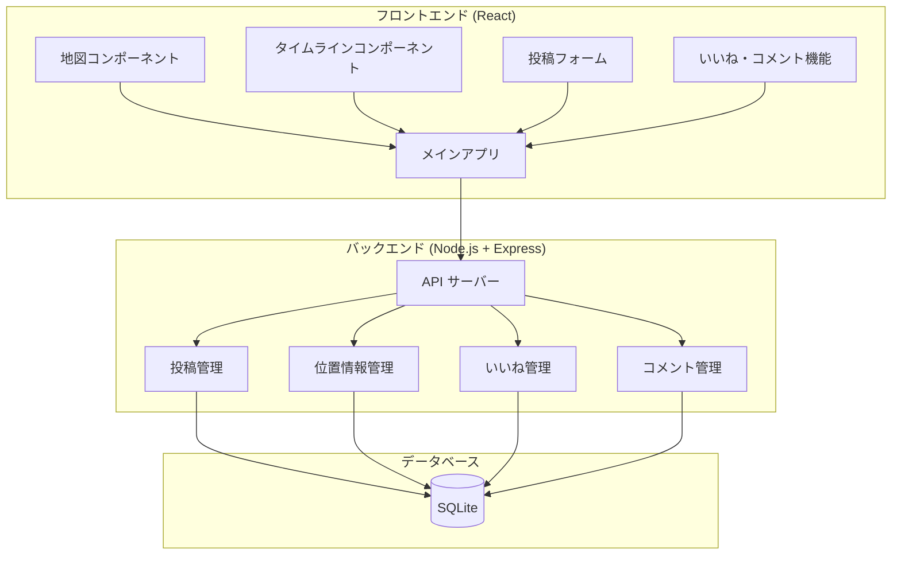
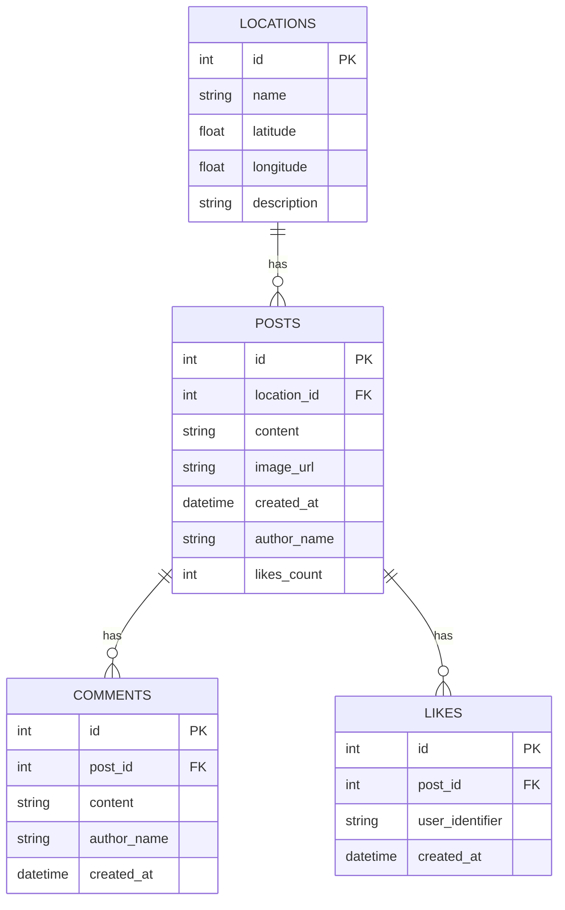
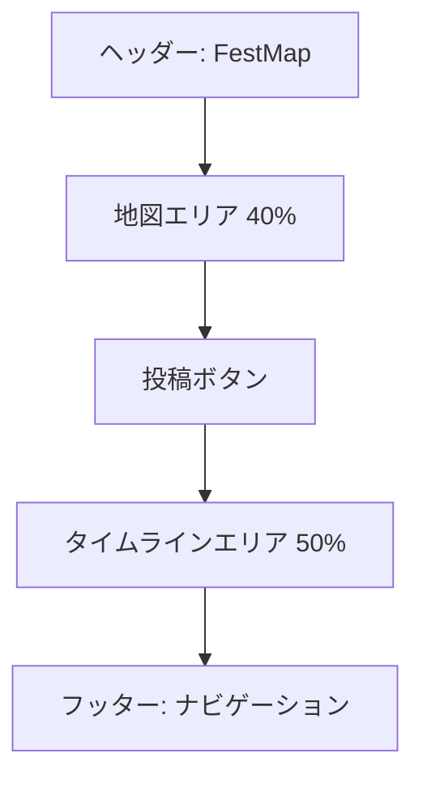
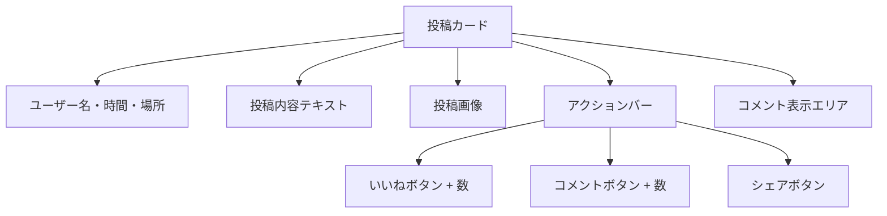

# 電通大学園祭SNSアプリ「FestMap」設計書

## 📋 プロジェクト概要

**電通大学園祭SNSアプリ「FestMap」**
- 上部：学園祭会場の地図とピン表示
- 下部：位置情報ベースのタイムライン（Twitter/Instagram風）
- **主要機能**：投稿、いいね、コメント機能
- 技術スタック：React + Node.js + SQLite
- 対象：スマートフォン
- 認証：不要（プロトタイプのため）

## 🏗️ システム設計

### アーキテクチャ構成



### データベース設計



## 📱 UI/UX設計

### 画面レイアウト（スマートフォン縦向き）



### 投稿カードコンポーネント



## 🛠️ 技術実装計画

### フロントエンド (React)
- **地図ライブラリ**: Leaflet + React-Leaflet
- **UI フレームワーク**: Material-UI または Tailwind CSS
- **状態管理**: React Hooks (useState, useEffect, useContext)
- **HTTP クライアント**: Axios
- **アイコン**: React Icons

### バックエンド (Node.js)
- **フレームワーク**: Express.js
- **データベース**: SQLite3
- **ファイルアップロード**: Multer
- **CORS**: cors middleware
- **バリデーション**: express-validator

### 開発環境
- **コンテナ**: Dev Container (Docker)
- **フロントエンド**: Create React App
- **バックエンド**: Nodemon for development
- **データベース**: SQLite Browser for debugging
- **API テスト**: Postman または Thunder Client

## 📂 プロジェクト構造

```
festmap/
├── .devcontainer/              # Dev Container設定
│   ├── devcontainer.json       # Dev Container設定ファイル
│   └── Dockerfile              # 開発環境用Dockerfile
├── client/                     # React フロントエンド
│   ├── public/
│   │   ├── index.html
│   │   └── favicon.ico
│   ├── src/
│   │   ├── components/
│   │   │   ├── Map.js              # 地図表示
│   │   │   ├── Timeline.js         # タイムライン
│   │   │   ├── PostForm.js         # 投稿フォーム
│   │   │   ├── PostCard.js         # 投稿カード
│   │   │   ├── LikeButton.js       # いいねボタン
│   │   │   ├── CommentSection.js   # コメント表示
│   │   │   └── CommentForm.js      # コメント投稿
│   │   ├── services/
│   │   │   └── api.js              # API通信
│   │   ├── styles/
│   │   │   └── App.css
│   │   ├── App.js
│   │   └── index.js
│   └── package.json
├── server/                     # Node.js バックエンド
│   ├── routes/
│   │   ├── posts.js            # 投稿API
│   │   ├── locations.js        # 位置情報API
│   │   ├── likes.js            # いいねAPI
│   │   └── comments.js         # コメントAPI
│   ├── models/
│   │   └── database.js         # DB設定・初期化
│   ├── middleware/
│   │   └── upload.js           # ファイルアップロード
│   ├── uploads/                # 画像保存ディレクトリ
│   ├── app.js                  # メインサーバーファイル
│   └── package.json
├── database/
│   └── festmap.db              # SQLiteデータベース
├── docker-compose.yml          # 開発環境用Docker Compose
├── PROJECT_PLAN.md             # この設計書
└── README.md                   # プロジェクト説明
```

## 🐳 Dev Container設定

### devcontainer.json
```json
{
  "name": "FestMap Development",
  "dockerComposeFile": "../docker-compose.yml",
  "service": "app",
  "workspaceFolder": "/workspace",
  "customizations": {
    "vscode": {
      "extensions": [
        "ms-vscode.vscode-typescript-next",
        "bradlc.vscode-tailwindcss",
        "esbenp.prettier-vscode",
        "ms-vscode.vscode-json",
        "ms-vscode.vscode-eslint"
      ],
      "settings": {
        "terminal.integrated.defaultProfile.linux": "bash"
      }
    }
  },
  "forwardPorts": [3000, 5000],
  "postCreateCommand": "npm install",
  "remoteUser": "node"
}
```

### Docker Compose設定
```yaml
version: '3.8'
services:
  app:
    build:
      context: .
      dockerfile: .devcontainer/Dockerfile
    volumes:
      - ..:/workspace:cached
    command: sleep infinity
    ports:
      - "3000:3000"
      - "5000:5000"
    environment:
      - NODE_ENV=development
```

### Dockerfile
```dockerfile
FROM node:18-bullseye

# 必要なパッケージをインストール
RUN apt-get update && apt-get install -y \
    git \
    sqlite3 \
    && rm -rf /var/lib/apt/lists/*

# 作業ディレクトリを設定
WORKDIR /workspace

# ユーザーを作成
RUN useradd -m -s /bin/bash node
USER node
```

## 🎯 開発フェーズ

### Phase 1: 基盤構築 (1-2日)
1. 開発環境設定
   - Dev Container設定ファイル作成
   - Docker環境構築
   - VSCode拡張機能設定
2. プロジェクト初期化
   - React アプリ作成
   - Node.js サーバー設定
   - 必要なパッケージインストール
3. データベース設計・作成
   - SQLite データベース作成
   - テーブル作成スクリプト
   - 初期データ投入
4. 基本的なAPI エンドポイント作成
   - Express サーバー設定
   - CORS 設定
   - 基本ルーティング

### Phase 2: コア機能開発 (2-3日)
1. 地図機能実装
   - Leaflet 地図表示
   - 電通大キャンパスマップ
   - ピン表示・クリック機能
2. 投稿機能実装
   - 投稿フォーム作成
   - 画像アップロード機能
   - 位置選択機能
3. タイムライン機能実装
   - 投稿一覧表示
   - 投稿カードコンポーネント
   - 位置フィルタリング

### Phase 3: インタラクション機能 (1-2日)
1. いいね機能実装
   - いいねボタンコンポーネント
   - いいね数表示
   - 重複防止機能
2. コメント機能実装
   - コメント表示コンポーネント
   - コメント投稿フォーム
   - コメント数表示

### Phase 4: 統合・調整 (1日)
1. フロントエンド・バックエンド統合テスト
2. レスポンシブデザイン調整
3. エラーハンドリング実装
4. パフォーマンス最適化

## 📍 電通大キャンパス位置データ

```javascript
const campusLocations = [
  { 
    id: 1, 
    name: "正門前", 
    lat: 35.6581, 
    lng: 139.5414,
    description: "メインエントランス"
  },
  { 
    id: 2, 
    name: "学生食堂", 
    lat: 35.6585, 
    lng: 139.5420,
    description: "食事・休憩スペース"
  },
  { 
    id: 3, 
    name: "図書館前", 
    lat: 35.6590, 
    lng: 139.5425,
    description: "静かな学習エリア"
  },
  { 
    id: 4, 
    name: "体育館", 
    lat: 35.6575, 
    lng: 139.5430,
    description: "スポーツイベント会場"
  },
  { 
    id: 5, 
    name: "研究棟A", 
    lat: 35.6595, 
    lng: 139.5415,
    description: "研究発表・展示エリア"
  },
  { 
    id: 6, 
    name: "中央広場", 
    lat: 35.6588, 
    lng: 139.5422,
    description: "メインステージ・イベント会場"
  },
  { 
    id: 7, 
    name: "購買部", 
    lat: 35.6583, 
    lng: 139.5418,
    description: "お土産・グッズ販売"
  },
  { 
    id: 8, 
    name: "駐車場", 
    lat: 35.6578, 
    lng: 139.5412,
    description: "来場者駐車スペース"
  }
];
```

## 🔧 API設計

### 投稿関連API
- `GET /api/posts` - 投稿一覧取得
- `GET /api/posts?location_id=:id` - 特定場所の投稿取得
- `POST /api/posts` - 新規投稿作成
- `GET /api/posts/:id` - 特定投稿取得
- `DELETE /api/posts/:id` - 投稿削除

### 位置情報API
- `GET /api/locations` - 位置情報一覧取得
- `GET /api/locations/:id` - 特定位置情報取得

### いいね機能API
- `POST /api/posts/:id/like` - いいね追加
- `DELETE /api/posts/:id/like` - いいね削除
- `GET /api/posts/:id/likes` - いいね数取得

### コメント機能API
- `GET /api/posts/:id/comments` - コメント一覧取得
- `POST /api/posts/:id/comments` - コメント追加
- `DELETE /api/comments/:id` - コメント削除

## 📱 レスポンシブデザイン仕様

### スマートフォン (320px - 768px)
- 地図エリア: 画面の40%
- タイムラインエリア: 画面の50%
- ヘッダー・フッター: 残り10%
- 投稿カード: 全幅表示
- フォント: 14px-16px

### タブレット (768px以上) - 参考
- 地図とタイムラインを横並び表示
- より多くの投稿を同時表示
- フォント: 16px-18px

## 🎨 デザインガイドライン

### カラーパレット
- プライマリ: #2196F3 (青)
- セカンダリ: #FF5722 (オレンジ)
- アクセント: #4CAF50 (緑)
- 背景: #F5F5F5 (ライトグレー)
- テキスト: #333333 (ダークグレー)

### アイコン
- いいね: ハートアイコン
- コメント: 吹き出しアイコン
- 位置: ピンアイコン
- 投稿: プラスアイコン

## 🚀 デプロイメント計画

### 開発環境
- フロントエンド: `npm start` (localhost:3000)
- バックエンド: `npm run dev` (localhost:5000)

### 本番環境 (将来的)
- フロントエンド: Netlify または Vercel
- バックエンド: Heroku または Railway
- データベース: PostgreSQL (本番用)

## 📝 今後の拡張可能性

### 短期的改善
- プッシュ通知機能
- 画像フィルター機能
- 投稿検索機能
- ユーザープロフィール

### 長期的改善
- リアルタイム更新 (WebSocket)
- 位置情報自動取得
- AR機能統合
- 多言語対応

---

**作成日**: 2025年6月19日  
**バージョン**: 1.0  
**作成者**: AI Assistant  
**プロジェクト名**: FestMap - 電通大学園祭SNSアプリ